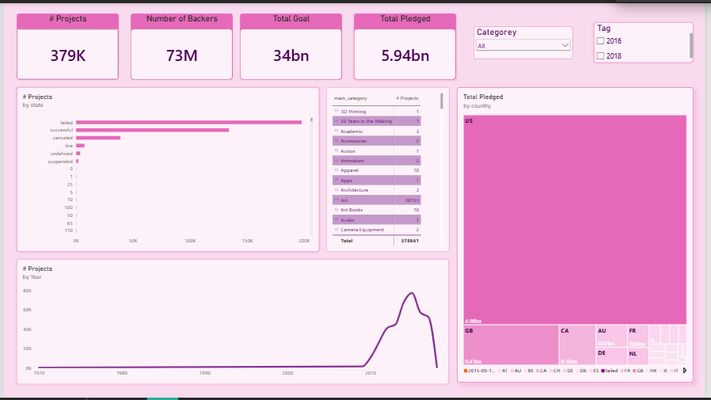

# 🚀 Kickstarter Crowdfunding Portfolio Analytics (Power BI & Power Query)

> An end-to-end Power BI business intelligence project evaluating 379K+ crowdfunding campaigns across two historical cohorts. Built by ingesting multi-file datasets using Power Query (M Language), engineering custom hierarchical models, creating dynamic DAX measures, and designing an executive analytics dashboard.

---

## 🖥️ Dashboard Preview



---

## 📌 Executive KPIs (Calculated Measures)

* **# Projects:** 379K total campaigns analyzed.
* **Number of Backers:** 73 Million global supporters.
* **Total Goal:** $34 Billion in requested campaign capital.
* **Total Pledged:** $5.94 Billion in realized funding secured.

---

## ⚙️ ETL & Data Transformation (Power Query / M)

The source data comprised two distinct datasets released on Kaggle ([Kickstarter Projects Dataset](https://www.kaggle.com/kemical/kickstarter-projects)):
* `ks-projects-201612.csv` (2016 Snapshot)
* `ks-projects-201801.csv` (2018 Snapshot)

### Transformation Steps:
1. **Source Tagging (Custom Column):**
   * Added a metadata column to each query before merging (`Tag` / `Cohort`) to preserve source file provenance (`2016` vs. `2018`).
2. **Table Union (Append Queries):**
   * Combined both datasets into a consolidated master table (`KSProjects`) using Power Query's `Table.Combine` (M Language).
3. **Query Optimization & Hygiene:**
   * Handled schema variations and matching columns between the two snapshots.
   * Enforced data types: `ID` (Text), `Goal` & `Pledged` (Decimal Currency), `Backers` (Integer), `Launched` & `Deadline` (Datetime/Date).
   * Hid the intermediate source queries (`2016`, `2018`) from the report view to streamline the modeling layer.

---

## 📐 Data Modeling & DAX Measures

### 1. Dimensional Hierarchy
* **Project Hierarchy:** Created a drill-down dimensional path to enable categorical exploration from high-level domains to specific initiatives:
  $$\text{Main Category} \longrightarrow \text{Category} \longrightarrow \text{Project Name}$$

### 2. Core DAX Measures
* **Number of Projects:**
  ```dax
  # Projects = COUNTROWS('KSProjects')
